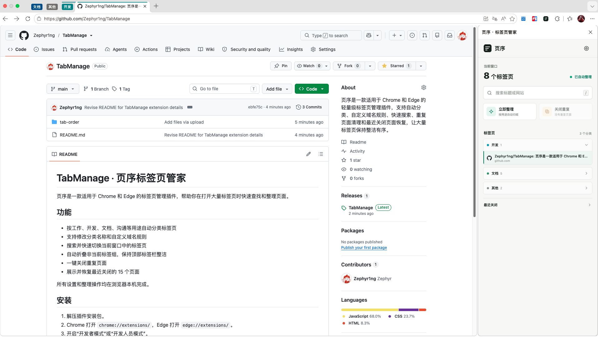

# TabManage · 页序标签页管家

页序是一款适用于 Chrome 和 Edge 的标签页管理插件，帮助你在打开大量标签页时快速查找和整理页面。

## 功能

- 按工作、开发、文档、沟通等用途自动分类标签页
- 支持修改分类名称和自定义域名规则
- 搜索并快速切换当前窗口中的标签页
- 自动折叠非当前标签组，保持顶部标签栏整洁
- 一键关闭重复页面
- 展示并恢复最近关闭的 15 个页面

所有设置和整理操作均在浏览器本机完成。

## 界面预览

## 使用

- 标签页较多时，插件会自动创建并整理浏览器标签组。
- 在搜索框中输入标题或网站名称，可快速查找页面。
- 点击“立即整理”可手动重新分类，点击“关闭重复”可清理重复页面。
- 展开“最近关闭”可恢复之前关闭的页面。
- 点击右上角设置按钮，可开关自动整理、修改分类名称和配置分类域名。

## 安装

1. 解压插件安装包。
2. Chrome 打开 `chrome://extensions/`，Edge 打开 `edge://extensions/`。
3. 开启“开发者模式”或“开发人员模式”。
4. 点击“加载已解压的扩展程序”，选择 `tab-order` 文件夹。
5. 点击浏览器工具栏中的“页序”图标打开侧边栏。
